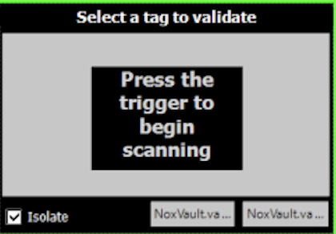

# NoxVaultDoD Findings (Documentation)

## **frmMain.cs**

### **panelMain**

Buttons

1. vbPack - Navigate to [panelPackType](###panelPackType) ( Set operation type: Pack)
2. vbModify - Navigate to [panelModifyType](###panelModifyType)
3. vbBreak - Navigate to [panelPackType](###panelPackType) ( Set operation type: Break)
4. vbCheck - Navigate to [panelPackType](###panelPackType) ( Set operation type: Check)
5. vbValidate - Navigate to [panelPackType](###panelPackType) ( Set operation type: Validate)
6. vbScan - Navigate to [panelFreeScan](###panelFreeScan)

Images

1. NOX Vault Logo

### **panelPackType**

Buttons   
&nbsp;&nbsp;&nbsp;&nbsp;&nbsp;&nbsp;&nbsp;
**_OT = Operation Type_**

1. vbPackTypeCase  
   OT: **Pack** - Navigate to [panelPack](###panelPack)  
   OT: **Break** - Navigate to [panelBreak](###panelBreak)  
   OT: **Check** - Navigate to [panelCheck](###panelCheck)  
   OT: **Validate** - Navigate to [panelValidate](###panelValidate)  

2. vbPackTypePallet  
   OT: **Pack** - Navigate to [panelPackTarget](###panelPackTarget) 
   OT: **Break** - Navigate to [panelBreak](###panelBreak)  
   OT: **Check** - Navigate to [panelCheck](###panelCheck)  
   OT: **Validate** - Navigate to [panelPackSelect](###panelPackSelect)

### **panelLocate**

Buttons

1. vbLocate\*Go - Call cItem class to search

Lists

1. nvListLocate - Displays search results

Textbox

1. txtLocate_Keyword - Keyword(s) input

### **panelReports**

Combo Boxes

1. cbReportsShipment

Lists

1. nvListReports

### **panelModifyType**

Buttons

1. vbModifyTypeAdd - Navigate to [panelModifyTarget](###panelModifyTarget) (Set modifyType: MODIFY_ADD)
2. vbModifyTypeRemove - Navigate to [panelModifyTarget](###panelModifyTarget) (Set modifyType: MODIFY_REMOVE)

### **panelLogin**

Buttons

1. vbLogin1 - Append "1" to login ID
2. vbLogin2 - Append "2" to login ID
3. vbLogin3 - Append "3" to login ID
4. vbLogin4 - Append "4" to login ID
5. vbLogin5 - Append "5" to login ID
6. vbLogin6 - Append "6" to login ID
7. vbLogin7 - Append "7" to login ID
8. vbLogin8 - Append "8" to login ID
9. vbLogin9 - Append "9" to login ID
10. vbLogin0 - Append "0" to login ID
11. vbLoginGo - Validate and Login, if valid: Navigate to [panelMain](###panelMain)

### **panelPackSelect**

Lists

1. nvListPackSelect

Buttons

1. vbPackSelectBack - Navigate to [panelPackType](###panelPackType)
2. vbPackSelectClear - Clear List

CheckBoxes

1. cbPackSelectIsolate - Toggle packIsolate value (_**true**_ or _**false**_)

### **panelFreeScan**

Textboxes

1. txtFreeScan

Buttons

1. vbFilter_Go - Empty function ?
2. vbFreeScan_Clear - Clear list

Lists

1. nvListFreeScan

### **panelReportDetail**

Lists

1. nvListReportDetail

### **panelModifyTarget**

Lists

1. nvListModifyTarget

Buttons

1. vbModifyTargetClear

### **panelValidate**

Lists

1. nvListValidate

Buttons

1. vbValidateClear
2. vbValidateDone - Navigate to [panelPackSelect](###panelPackSelect)

### **panelBreak**

Textboxes

1. txtBreakFilter

Lists

1. nvListBreak

Buttons

1. vbBreakFilterGo -
2. vbBreakDone - Navigate to [panelMain](###panelMain)
3. vbBreakClear - Clear List

### **panelPack**

Lists

1. nvListPack

Buttons

1. vbPackDone - Navigate to [panelMain](###panelMain)
2. vbPackClear
3. vbPackDonePrint

CheckBoxes

1. cbPackRFID

### **panelBreakConfirm**

Buttons

1. vbBreakConfirmYes - Navigate to [panelBreak](###panelBreak) (w/ breakItem() func)
2. vbBreakConfirmNo - Navigate to [panelBreak](###panelBreak)

### **panelModify**

Buttons

1. vbModifyCancel - Navigate to [panelMain](###panelMain)
2. vbModifyClear -
3. vbModifyDone -

Check Boxes

1. cbModifyRFID - Toggle setScannable (**_true_** or **_false_**)

### **panelCheck**

Buttons

1. vbCheckClear  
   packType: Case - PackQty: config.itemsPerCase  
   packType: Pallet - PackQty: config.casesPerPallet  
   packType: Ship - PackQty: config.itemsPerCase
2. vbCheckDone - panelPackType

### **panelPackTarget**

Lists

1. nvListPackTarget

### **panelPackResult**

### **panelPackPrint**

1. vbPackPrintYes
2. vbPackPrintNo - Navigate to [panelPack](###panelPack)

### **panelModifyResult**

Buttons

1. vbModifyResultDone - Navigate to [panelMain](###panelMain)
